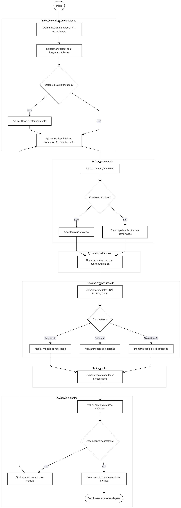

# Projeto de Metodologia para Processamento de Imagens

Este projeto apresenta uma metodologia para comparar, selecionar, combinar e aprimorar técnicas de processamento de imagem, com foco na detecção e classificação de falhas em cadeias de isoladores. A proposta inclui a definição de métricas, escolha de modelos de redes neurais, análise de datasets e desenvolvimento de métodos para ajuste de parâmetros e combinação de processamentos.

A dissertação aborda desde os fundamentos teóricos até a aplicação prática da metodologia, incluindo a análise de resultados e as contribuições para a área de processamento de imagens.

A seguir, é apresentada uma imagem ilustrativa da metodologia proposta:

# Dissertação completa
Para baixar a dissertação completa, clique [aqui](https://github.com/luanws/masters-thesis/releases/latest/download/Dissertacao.pdf).